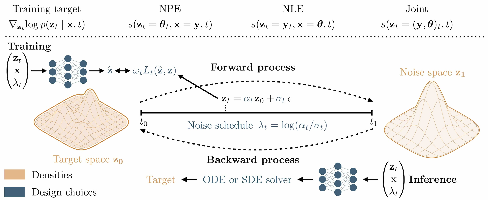
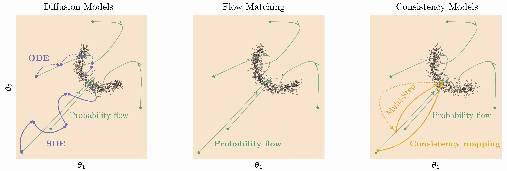

# Diffusion Models in Simulation-Based Inference — a BayesFlow Tutorial

[](https://colab.research.google.com/github/vepe99/BayesflowTutorial/blob/main/Diffusion_Models_presentation.ipynb)

A hands-on tutorial on **simulation-based inference (SBI)** with [BayesFlow](https://bayesflow.org),
using **diffusion models** (and a comparison with flow matching and consistency models).
Everything runs in the browser — just click the badge above to open it in your own Google Colab.



## What you'll learn

1. **What is simulation-based inference (SBI)?**
2. **What are diffusion models?**
3. **Why are diffusion models so well suited for SBI?**

We work through a simple [inverse-kinematics](https://arxiv.org/pdf/2101.10763.pdf) problem — given
the end position of a 3-segment planar robot arm, infer the arm configuration — and along the way:

- define a *prior* over parameters and a *simulator* producing synthetic observations,
- generate a training dataset by forward simulation,
- train an amortized inference model using **diffusion-based SBI** in BayesFlow,
- draw approximate posterior samples for a new observation,
- compare diffusion models to **flow matching** and **consistency models**,
- explore *post-hoc* modifications of the inference network.



## How to run it

### Option A — Google Colab (recommended)

1. Click the **Open in Colab** badge at the top.
2. Run the cells top to bottom. The first cells `pip install bayesflow keras` and set up the
   environment — no local installation required.
3. (Optional) Switch to a GPU runtime via *Runtime → Change runtime type* for faster training.

### Option B — run locally

```bash
git clone https://github.com/vepe99/BayesflowTutorial.git
cd BayesflowTutorial
pip install bayesflow keras jupyter
jupyter notebook Diffusion_Models_presentation.ipynb
```

## Repository contents

| Path | Description |
| --- | --- |
| `Diffusion_Models_presentation.ipynb` | The full tutorial notebook. |
| `misc/diffusion/` | Figures and the `kinematics_helper.py` used by the notebook. |

## Credits & references

- Tutorial material adapted from the diffusion-model SBI paper: https://arxiv.org/abs/2512.20685
- Companion experiments: https://github.com/bayesflow-org/diffusion-experiments
- BayesFlow: https://bayesflow.org
